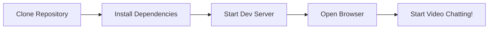
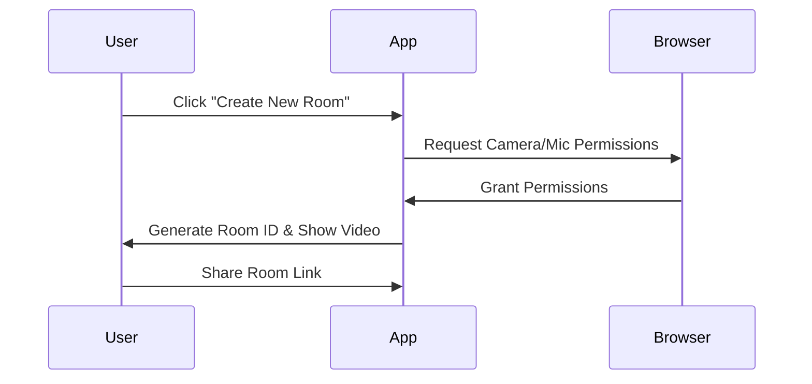
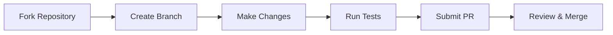

<p align="center">

</p>

<!-- Typing SVG Animation -->
<div align="center">
  

<br>

[](https://chatreall.netlify.app/)
[](https://app.netlify.com/sites/chatreall/deploys)
[](https://opensource.org/licenses/MIT)
[](https://www.typescriptlang.org/)
[](https://reactjs.org/)

**Modern, secure and instant video chat application built with React, TypeScript, and WebRTC**

[Live Demo](https://chatreall.netlify.app/) • [Documentation](#) • [Report Bug](https://github.com/your-username/chat-real/issues) • [Request Feature](https://github.com/your-username/chat-real/issues)

</div>

## Features

<!-- Features with aligned badges -->
<div align="left">

| Feature | Description |
|:---|:---|
| **HD Video Calls** | High quality video with WebRTC technology |
| **Crystal Clear Audio** | Clear sound with noise cancellation |
| **Private & Secure** | Encrypted P2P connection, no data on server |
| **Multi-device** | Works on desktop, tablet and mobile |
| **Instant Rooms** | Create or join rooms quickly |
| **Unlimited Time** | No time restrictions on calls |
| **Camera Test** | Test your camera and microphone before joining |
| **Modern UI** | Clean, responsive design with modern header |

</div>

## Tech Stack

<!-- Tech Stack aligned to left -->
<div align="left">


</div>

## Quick Start

### Prerequisites

<!-- Prerequisites aligned left -->
<div align="left">


</div>

### Installation

<div align="left">

```bash
# 1. Clone the repository
git clone https://github.com/your-username/chat-real.git
cd chat-real

# 2. Install dependencies
npm install

# 3. Start development server
npm run dev

# 4. Open your browser
# http://localhost:5173
```

</div>

<div align="center">

<!-- Workflow diagram -->


</div>

## Available Scripts

<div align="left">

| Command | Description |
|---------|-------------|
| `npm run dev` | Start development server |
| `npm run build` | Build for production |
| `npm run preview` | Preview production build |
| `npm run lint` | Run ESLint |
| `npm run type-check` | Run TypeScript compiler |

</div>

## Project Structure

<div align="left">

```typescript
src/
├── 📁 components/          # React components
│   ├── CameraTest/     # Camera/microphone testing
│   ├── Controls/       # Video call controls
│   ├── Header/         # Navigation header
│   ├── Landing/        # Landing page
│   ├── ShareButton/    # Room link sharing
│   ├── VideoChat/      # Main video chat interface
│   └── VideoContainer/ # Video display container
├── 📁 hooks/              # Custom React hooks
│   └── useVideoChat.ts # Video chat state management
├── 📁 services/           # Business logic
│   └── WebRTCService.ts # WebRTC implementation
├── 📁 types/              # TypeScript type definitions
├── 📁 utils/              # Utility functions
│   └── roomUtils.ts    # Room ID generation
├── App.tsx             # Main app component
├── main.tsx           # App entry point
└── index.css          # Global styles
```

</div>

## Usage

### Creating a Room

<div align="center">

<!-- Sequence diagram -->


</div>

<div align="left">

1. **Click** "Create New Room" on the homepage
2. **Allow** camera and microphone permissions
3. **Share** the room link with others

### Joining a Room

1. **Paste** the room ID in the "Join Existing Room" input
2. **Click** "Join Room" or press Enter
3. **Allow** camera and microphone permissions

### During a Call

| Feature | Description |
|---------|-------------|
| Camera Toggle | Toggle video on/off |
| Microphone Toggle | Toggle audio on/off |
| End Call | End call and return home |
| Share Room | Copy room link to share |

</div>

## 🔧 Configuration

### Environment Variables

<div align="left">

Create a `.env` file in the root directory:

```env
# Optional: Custom STUN/TURN servers for better connectivity
VITE_STUN_SERVER=stun:your-server.com:3478
VITE_TURN_SERVER=turn:your-server.com:3478
VITE_TURN_USERNAME=your-username
VITE_TURN_PASSWORD=your-password

# Optional: App configuration
VITE_APP_NAME="Chat Real"
VITE_APP_VERSION=1.0.0
```

</div>

### Browser Compatibility

<div align="left">

| Browser | Version | Status |
|---------|---------|--------|
| Chrome | 60+ | Fully Supported |
| Firefox | 60+ | Fully Supported |
| Safari | 13+ | Fully Supported |
| Edge | 79+ | Fully Supported |

</div>

<div align="left">

**Note**: Requires HTTPS for camera/microphone access in production.

</div>

## Deployment

### Deploy to Netlify

<div align="left">

[](https://app.netlify.com/start/deploy?repository=https://github.com/your-username/chat-real)

</div>

<div align="left">

1. **Click** the deploy button above
2. **Connect** your GitHub repository
3. **Deploy** automatically

### Manual Deployment

```bash
# Build the project
npm run build

# The dist/ folder is ready for deployment
```

**Supported Platforms**:
- Netlify
- Vercel  
- GitHub Pages
- Firebase Hosting
- Any static hosting service

</div>

## 🤝 Contributing

<div align="center">

We love your input! We want to make contributing as easy and transparent as possible.

<!-- Another typing animation -->
<div align="center">
  
</div>

</div>

### Development Workflow

<div align="center">



</div>

### Steps to Contribute

<div align="left">

1. **Fork** the repository
2. **Create** a feature branch: `git checkout -b feature/amazing-feature`
3. **Commit** your changes: `git commit -m 'Add amazing feature'`
4. **Push** to the branch: `git push origin feature/amazing-feature`
5. **Open** a Pull Request

### Development Guidelines

- Use TypeScript for all new code
- Follow React best practices
- Use CSS Modules for styling
- Write meaningful commit messages
- Test your changes thoroughly
- Update documentation if needed

</div>

## Roadmap

<div align="left">

| Status | Feature | Description |
|--------|---------|-------------|
| 🔄 | Screen Sharing | Share your screen during calls |
| 🔄 | Chat Messages | Text chat alongside video |
| 🔄 | Recording | Record your video calls |
| ⏳ | Background Effects | Virtual backgrounds and blur |
| ⏳ | Room Passwords | Secure rooms with passwords |
| ⏳ | Mobile App | React Native application |
| ⏳ | Multiple Participants | Support for group calls |
| ⏳ | File Sharing | Share files during calls |
| ⏳ | Whiteboard | Collaborative drawing board |

</div>

## Known Issues & Solutions

<div align="left">

| Issue | Solution |
|-------|----------|
| Camera access denied initially | Refresh the page and allow permissions |
| iOS Safari audio issues | Use Chrome or Firefox on iOS |
| Firefox media device enable | Manually enable in browser settings |
| Connection issues | Check firewall and network settings |

</div>

## License

<div align="center">

This project is licensed under the MIT License - see the [LICENSE](LICENSE) file for details.

<!-- GitHub stats with animations -->
<div align="center">


</div>

</div>

## 🙏 Acknowledgments

<div align="left">

- **WebRTC API** - Real-time communication technology
- **React Team** - Amazing frontend framework
- **Material Design** - Beautiful icon system
- **Inter Font** - Clean typography by Rasmus Andersson
- **Vite** - Lightning-fast build tool

</div>

## 📞 Support

<div align="left">

| Platform | Link | Response Time |
|----------|------|---------------|
| GitHub Issues | [Report Bug](https://github.com/juninhokaponne/chat-real/issues) | 24-48 hours |
| Discussions | [Start Discussion](https://github.com/juninhokaponne/chat-real/discussions) | 12-24 hours |
| Bug Reports | [Bug Tracker](https://github.com/juninhokaponne/chat-real/issues) | 24 hours |
| Feature Requests | [Feature Ideas](https://github.com/juninhokaponne/chat-real/issues) | 48 hours |

</div>

---

<div align="center">

### ⭐ Don't forget to star the repository if you find this project useful!

<!-- Animated visitor counter -->


<!-- Final typing animation -->
<div align="center">
  
</div>

**Happy Video Chatting!** 

**Made with ❤️ by the Chat Real community**

</div>
